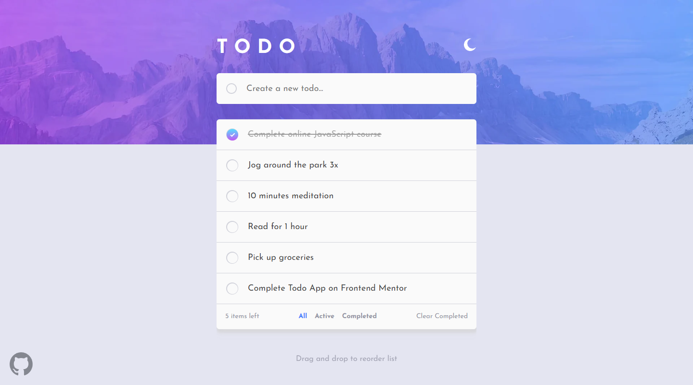
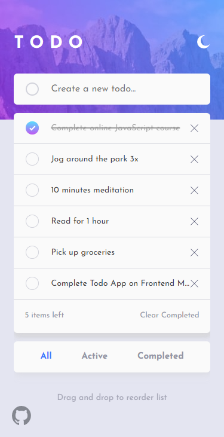

# Frontend Mentor - Todo app solution

This is a solution to the [Todo app challenge on Frontend Mentor](https://www.frontendmentor.io/challenges/todo-app-Su1_KokOW). Frontend Mentor challenges help you improve your coding skills by building realistic projects.

## Table of contents

-   [Frontend Mentor - Todo app solution](#frontend-mentor---todo-app-solution)
    -   [Table of contents](#table-of-contents)
    -   [Overview](#overview)
        -   [The challenge](#the-challenge)
        -   [Screenshot](#screenshot)
        -   [Links](#links)
    -   [My process](#my-process)
        -   [Built with](#built-with)
        -   [What I learned](#what-i-learned)
        -   [Useful resources](#useful-resources)
    -   [Author](#author)

## Overview

### The challenge

Users should be able to:

-   ✅ View the optimal layout for the app depending on their device's screen size
-   ✅ See hover states for all interactive elements on the page
-   ✅ Add new todos to the list
-   ✅ Mark todos as complete
-   ✅ Delete todos from the list
-   ✅ Filter by all/active/complete todos
-   ✅ Clear all completed todos
-   ✅ Toggle light and dark mode
-   ✅ **Bonus**: Drag and drop to reorder items on the list

### Screenshot

### Links

-   Solution URL: https://github.com/Brooklyn-Dev/todo-app
-   Live Site URL: https://todo-app-brooklyn.netlify.app

## My process

### Built with

-   Semantic HTML5 markup
-   CSS custom properties
-   Flexbox
-   Desktop-first workflow
-   [React](https://reactjs.org/) - JS library
-   [Vite](https://vitejs.dev/) - Frontend Build Tool
-   [TypeScript](https://www.typescriptlang.org/)
-   [SASS](https://sass-lang.com/) - For styling
-   BEM architecture

### What I learned

-   Using Typescript & Vite with React
-   How to make a theme toggle
-   How to generate `UUIDs`
-   How to implement vanilla JS/TS drag and drop functionallity
-   How to use media queries within vanilla JS/TS
-   Overall consolidation of fundamental React knowledge

### Useful resources

-   [MDN](https://developer.mozilla.org/en-US/) - Good source for general webdev docs. Useful for making checkboxes and learning about `Window.matchMedia()`
-   [React Docs](https://react.dev/) - Essential documentation for anyone learning react. Good reference when creating custom `hooks` and using `refs`.
-   [TypeScript Docs](https://www.typescriptlang.org/docs/handbook/) - For learning TypeScript.

## Author

-   Frontend Mentor - [@Brooklyn-Dev](https://www.frontendmentor.io/profile/Brooklyn-Dev)
-   Twitter - [@BklynDev1](https://x.com/BklynDev1)
